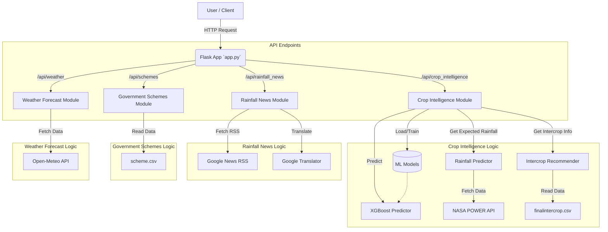

# KrishiNova Workflow

This document describes the workflow of the KrishiNova Unified API Backend.

## System Architecture

## Detailed Workflow

### 1. Crop Intelligence (`/api/crop_intelligence`)
*   **Input**: Nitrogen (N), Phosphorus (P), Potassium (K), pH, Rainfall, Temperature, Humidity.
*   **Process**:
    1.  **Model Loading**: Checks for saved models in `models/`. If missing, trains XGBoost models using `crop.csv` and saves them.
    2.  **Prediction**: Uses XGBoost models to predict:
        *   Optimal Crop
        *   Fertilizer Recommendation
        *   Days to Harvest
        *   Water Requirement
    3.  **Rainfall Analysis**: Calls `rainfall_predictor.py` to fetch historical data from **NASA POWER API** and predict expected rainfall for the crop duration.
    4.  **Intercrop Recommendation**: Calls `intercrop.py` to lookup suitable intercrops from `finalintercrop.csv`.
*   **Output**: JSON containing predictions and recommendations.

### 2. Rainfall News (`/api/rainfall_news`)
*   **Input**: `limit` (optional), `translate` (optional).
*   **Process**:
    1.  Fetches RSS feed from **Google News** for agriculture topics in Maharashtra (Marathi).
    2.  Parses the XML feed.
    3.  Optionally translates titles to English using `deep_translator`.
*   **Output**: List of news items with titles, links, and dates.

### 3. Government Schemes (`/api/schemes`)
*   **Process**:
    1.  Reads `scheme.csv`.
    2.  Parses the CSV into a structured list of schemes.
*   **Output**: JSON list of government schemes.

### 4. Weather Forecast (`/api/weather`)
*   **Input**: Latitude, Longitude, Days.
*   **Process**:
    1.  Calls **Open-Meteo API** to get daily and hourly weather data.
    2.  Aggregates hourly humidity to daily averages.
    3.  Combines temperature, windspeed, rainfall, and humidity data.
*   **Output**: JSON forecast data for the requested days.
